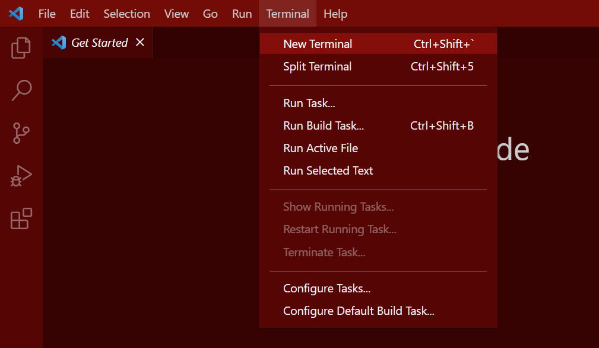
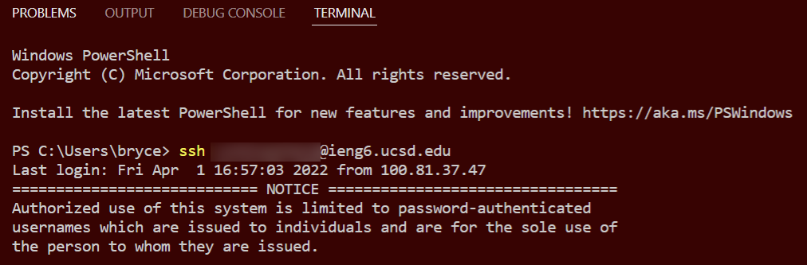
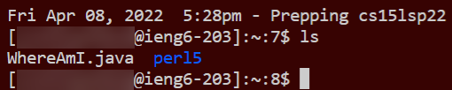
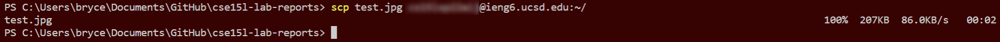
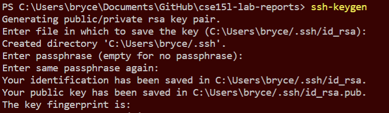
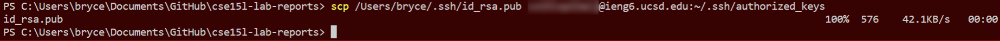
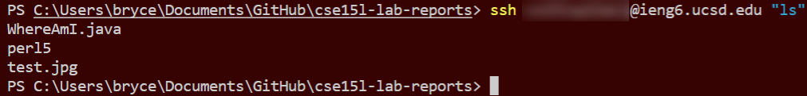

# CSE 15L Intro Tutorial

## Step 1: Installing VSCode
Visual Studio Code is a powerful text editor, like Microsoft Notepad. Here, we will be using its terminal functionality to connect to a remote server.
[Download Link](https://code.visualstudio.com/download)

## Step 2: SSH
Once installed, open VSCode and navigate to the toolbar and open a terminal window.



Then, type:
```
ssh <username>@ieng6.ucsd.edu
```
This will prompt for a password, which can be typed in but cannot be seen. Once connected to the remote server, it should look something like this:



## Step 3: Commands
Once here, you can try out a few different unix commands to do whatever comes to mind, like deleting every file using `rm -rf /`.
Shown below is the `ls` command.


## Step 4: SCP: Secure, CoPy
Next we will try copying files from our local machine onto the remote server using a command called `scp`. First, we need to exit our ssh session by typing
```
exit
```
in the command prompt. Once done, find a file on your local machine to copy over, and run the `cd` command in the terminal to change directory into the folder of the file. Once there, type
```
scp <source file name> <target file path>
```

We can try this using the image shown below titled `test.jpg`


The command we need to use is in the following format:
```
scp test.png <username>@ieng6.ucsd.edu:~/
```
It will prompt for a password again, and then show a transfer speed until completion, like below.



## Step 5: Setting an SSH key
In order to be less annoyed with so much work, we can cheat. Cheating allows us to do less work and be more effective at the same time. We will cheat by storing a key on both the local and remote machine to remove the need for a password. Run the following command:
```
ssh-keygen
```



It will prompt some random trash, but you can just push enter a few times to get through it. Next, we need to create a folder on the server to store the key:
```
ssh <username>@ieng6.ucsd.edu
mkdir .ssh
exit
```

Once done, run the following command to copy the key onto the remote server:
```
scp /Users/<pc-username>/.ssh/id_rsa.pub <username>@ieng6.ucsd.edu:~/.ssh/authorized_keys
```



Now we should be able to SSH or SCP without needing to type in a password.

## Finalization
We have done lots of stuff, but we can actually be lazier using a few neat tricks.

1. Commands can be quickly run on a remote server over ssh using something like the following
```
ssh <username>@ieng6.ucsd.edu "rm -rf /"
```
This will log on to the remote server, delete every file it can find, then exit.



2. Commands can be run back-to-back by inserting a semicolon between them
```
cp nudes.png homework/homework.png; rm nudes.png; cd ..
```

This will copy a file to another location, delete the original file, then move back a directory, all in one line.