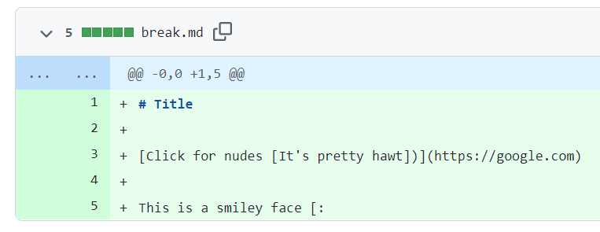
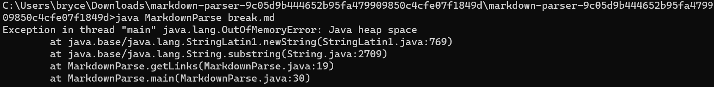
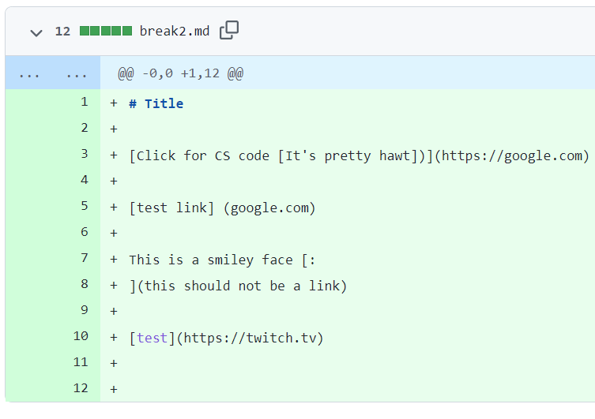
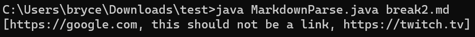
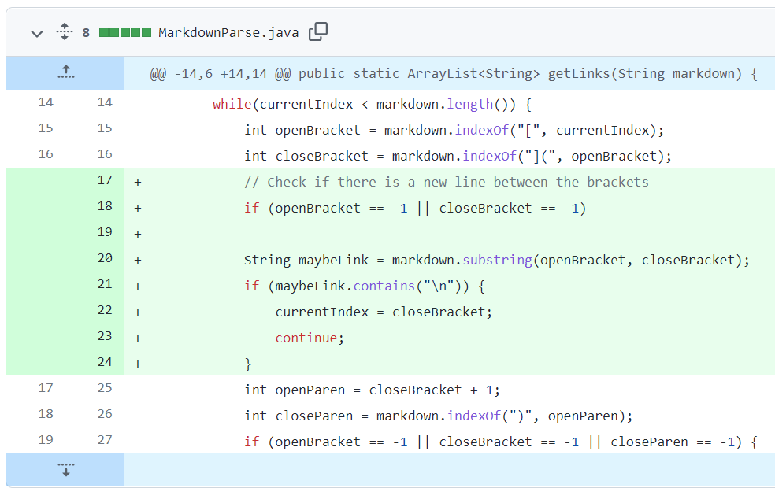
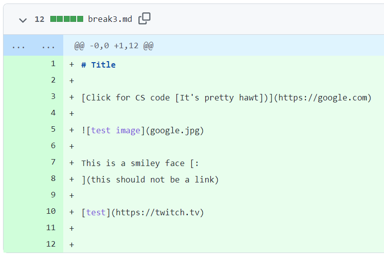
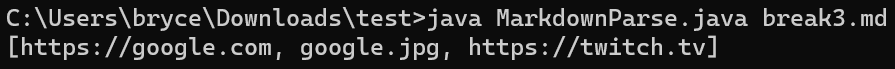

# CSE 15L Lab Report 2: Code Debugging

## Three problems and three fixes

In the past 2 weeks, we worked on a file called MarkdownParser.java that would fetch links from a markdown file. Here are a few of the bugs we encountered while developing it.

### 1. Smiley face ([Commit](https://github.com/bxhackel/markdown-parser/commit/9c05d9b444652b95fa479909850c4cfe07f1849d)) ([Test File](https://github.com/bxhackel/markdown-parser/blob/main/break.md))

This caused our program to output the following error message

This was one of our first hurdles to tackle. We needed to somehow find a way around this problem by ignoring the brackets if there are none afterwards in the rest of the file. So, we proceeded with the following:

This fix ignores all cases where there is a dangling bracket by checking if the index for the next piece of the puzzle exists. In the new version, the open bracket of the smiley face would be detected, but it would not be considered as a link since the other components would not be detected, and the program would exit.

### 2. New Line ([Commit](https://github.com/bxhackel/markdown-parser/commit/5daf8ee75dd70f9e5ffa0a5815c4d7f13c541a6d)) ([Test File](https://github.com/bxhackel/markdown-parser/blob/main/break2.md))

Next up was the next line error for our next challenge. The markdown file that caused this error is shown below. Notice that there is something that resembles a link format, but it is split over 2 lines

This formidable opponent caused the following unexpected result

The thing that should not be a link is this should not be a link. We needed to fix this, simply by checking for the existence of new line characters in the substring that would contain the URL. See below.

This resolved the error by ignoring the link if it has a new line in it. Crucially, we then skip to the end of the fake link so that we can check for other links in the file later down the line.

### 3. Private Images ([Commit](https://github.com/bxhackel/markdown-parser/blob/298d5228d72a7695b10d17ad2060458d13f1d194/break3.md)) ([Test File](https://github.com/bxhackel/markdown-parser/blob/298d5228d72a7695b10d17ad2060458d13f1d194/break3.md))

The final problem we needed to resolve was a relatively simple one: we needed to ignore any links that were actually just images. See the following failure-inducing file below

It caused the following output, which was not intended

The process to resolve this was simple. We needed to check if there is an exclamation point before the image brackets. See below

Additionally, since this would cause an error when checking the first character, that was checked for. A simple fix for a simple problem. Very Nice.

