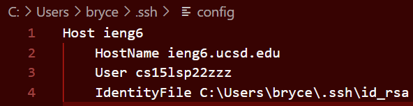
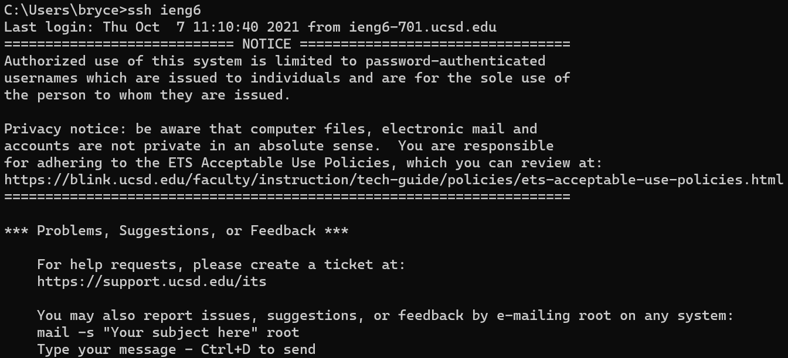
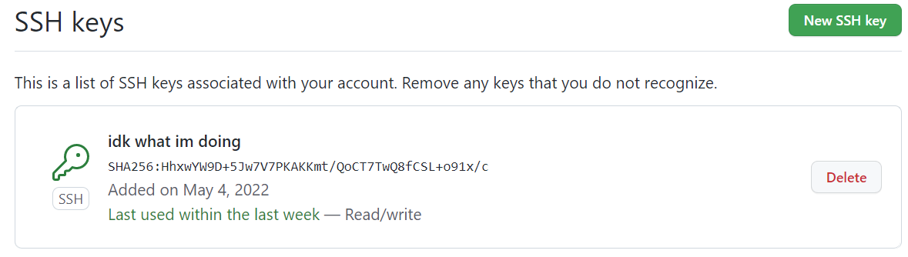
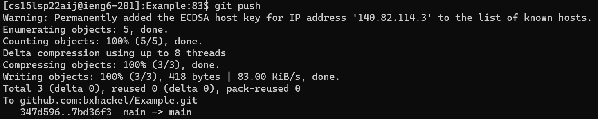
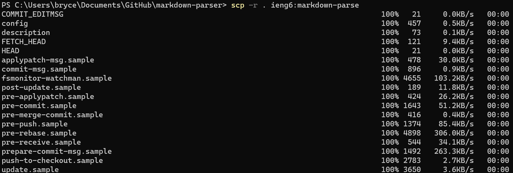
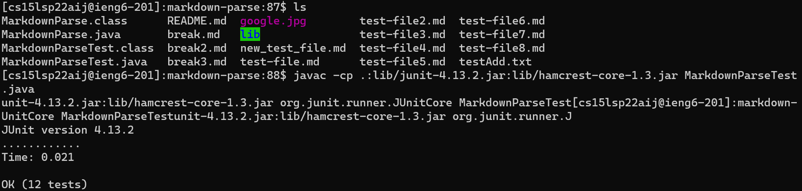
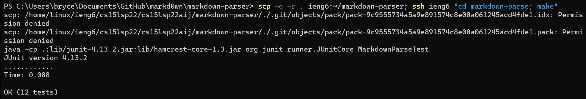

# CSE 15L Lab Report 3: Misc Etc

## Speedy SSH
The configuration shown below allows a user to SSH into a server using a username rather than the full hostname.

This makes it much faster to connect and copy files, like below.

## Github in Server
Next is setting up SSH keys to allow editing a repository from the command line.

Here is the private key on the server

And now, a successful push to the remote repository. [Link](https://github.com/bxhackel/Example/commit/7bd36f31f36980f8188e52b53fc096934a53aee0)

## Speed Copy
Finally, the following can be used to copy whole directories using `scp` rather than single files.

This allows for quick testing and execution.

We can combine the two into one command to run them all.
