# CSE 15L Lab Report 4: Mark Parse Down

For this week, we will be rigorously testing the MarkdownParse.java code to look for flaws that might cause things to break. 

## Snippet 1

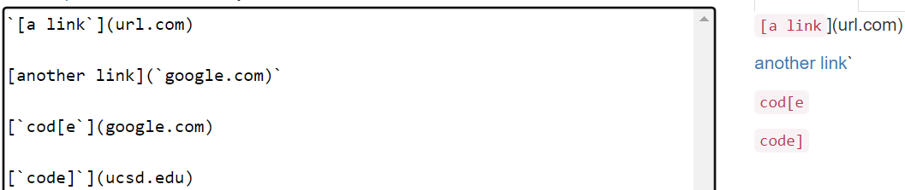

First up is this small bit of markdown. The valid links in this case are "`google.com", "google.com", "ucsd.edu".

We add this as a test to the code:
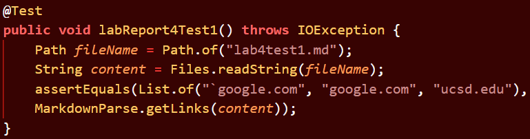

Running this test on our code gives the following result.

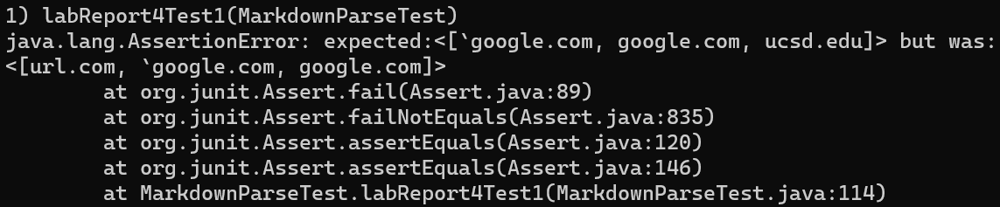

Running on the other group's code gives this as a result.

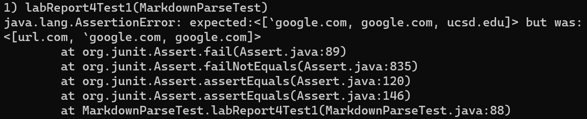

As shown above, the test failed. The program grabbed the extra url.com at the start of the file, and missed the final ucsd.edu link.
The reason for catching the extra first link comes down to the backticks capturing the part that identifies the link text. For missing the final link, this is also because of the backticks capturing text, and the fact that my program checks for extra closing brackets within text blocks.

 To fix this, the code would need to identify these codeblocks by checking for backtick locations within each line. Then, it would need to ignore any text between two backticks. I think this solution would require more than 10 lines to accomplish, because of the complexity of detecting opening and closing backticks, without a unique character like with brackets.

## Snippet 2

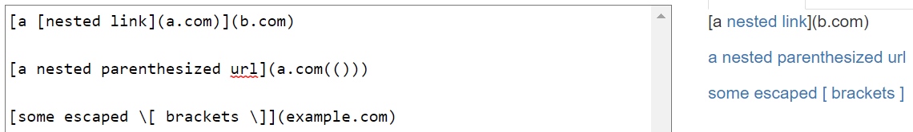

Next is this set of markdown links. This tests nested links and paired parenthesis or brackets within links. The expected links are "a.com", "a.com(())", "example.com".

We add this as a test to the code:
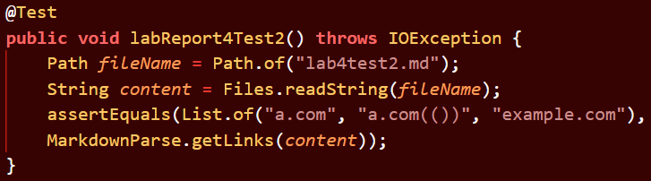

Running this test on our code gives the following result.

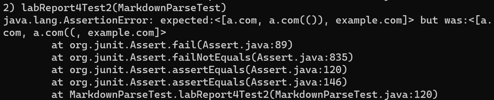

Running on the other group's code gives this as a result.

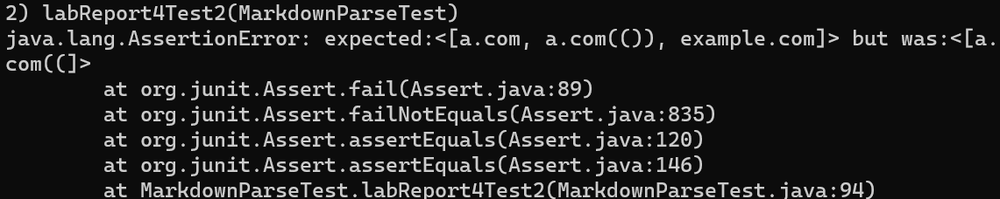

As shown above, the test failed. The test shows our code nearly getting the correct set of links, but failing to incorporate the two closing parenthesis for the second link. 

I think a small code change of less than 10 lines could fix this problem, and possibly account for other issues relating to nested parenthesis. The code would need to ignore the number of opening parenthesis that it finds while iterating each character in the link text.

## Snippet 2

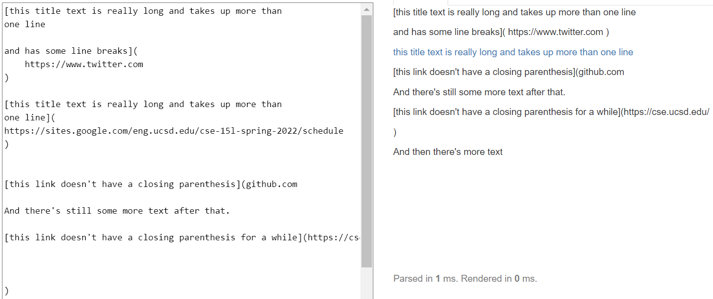

Finally, the last set is shown above. This one attempts to cover cases involving new lines between links. The expected output is the following one link: "https://sites.google.com/eng.ucsd.edu/cse-15l-spring-2022/schedule"

We add this as a test to the code:
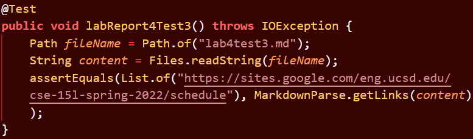

Running this test on our code gives the following result.

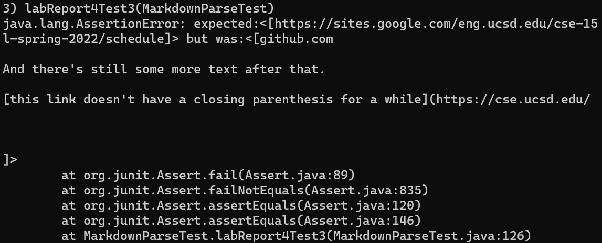

Running on the other group's code gives this as a result.

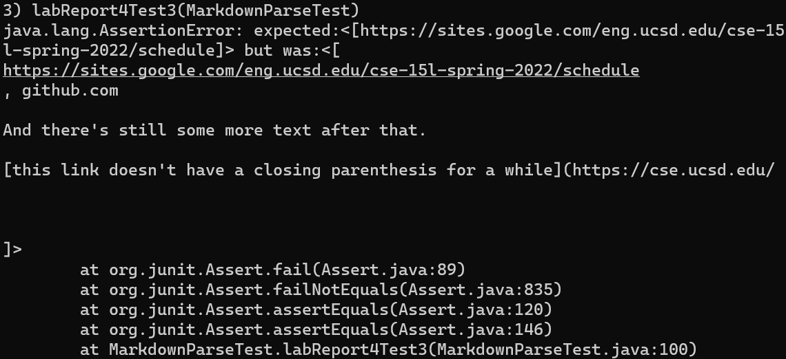

As shown above, the test failed once again. For our code, we added a catch to detect new lines in between the link text, but we forgot to account for the fact that markdown ignores single new lines when parsing. The other failure was not checking for new lines within the actual links themselves.

The fix for both of these issues would require less than 10 lines, and would involve checking for double new line characters rather than single new line characters, in addition to checking the links for new lines in the same manner. Once one of these conditions is met, the currentIndex can be moved to the point past these invalid links when parsing.

