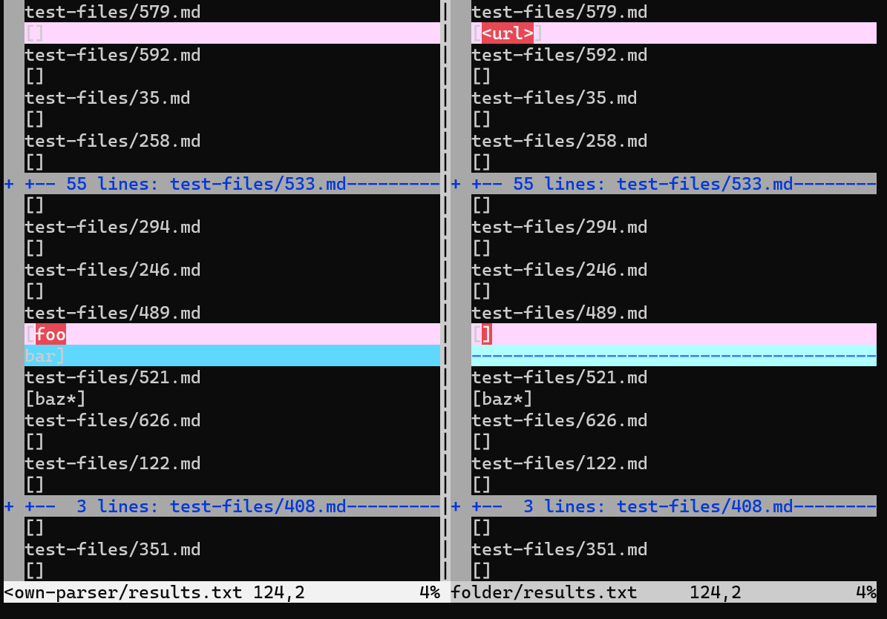
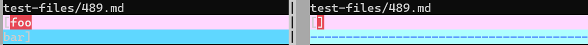
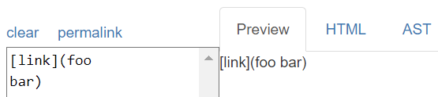
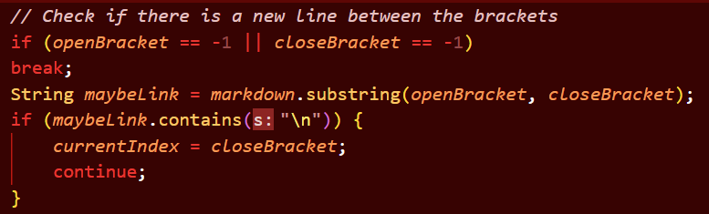
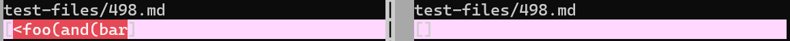
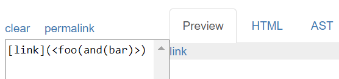
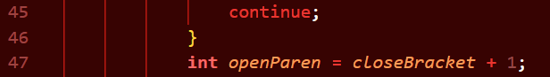
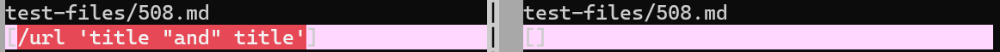
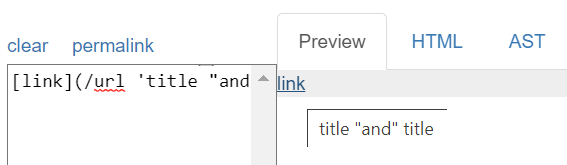
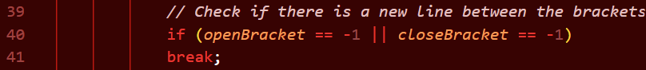

# CSE 15L Lab Report 5: Bug

## Comparing Implementations

In this lab, we needed to find the difference between two implementations of the markdown parse code for finding links.

To do this, we used a program called `vimdiff` that shows only the differences between the content of two text files. We used a bash script to run both MarkdownParse implementations on a large number of files. Here is an example of the output of `vimdiff`.

## Test File #489

The image below shows the difference between our implementation (left) and the implementation given by the TAs (right) for the test linked [here](https://github.com/nidhidhamnani/markdown-parser/blob/main/test-files/489.md)

The pink shows that there is a difference in that line, whereas the blue shows an addition of a new line. Lets check the expected result.

This means our expected list of links should be empty. This means our implementation failed, and the implementation given by the TAs succeeded. 

To fix the code, there needs to be a check to ignore new line characters within the URL component of the link. The code would look very similar to this code that already exists within our markdown parser, but would go after this and check within the parenthesis rather than the brackets.

## Test File #498

Next up is this comparison in `vimdiff` for the test file linked [here](https://github.com/nidhidhamnani/markdown-parser/blob/main/test-files/498.md).

The expected result is the following:

As seen here, the expected reuslt is to have 1 link with content "foo(and(bar)"

This means that both implementations failed to properly parse the link. In our case, the code grabbed an extra angled bracket at the front of the link, whereas the TA implementation missed the link entirely.

To fix this problem in the code, there should be a check that removes all open and close pairs of angled brackets. This could be implemented using a stack that adds open brackets when encountering them, and removes them when encountering closing brackets. It should be added in the following area in the code.

## Test File #508

FInally is the test file #508 linked [here](https://github.com/nidhidhamnani/markdown-parser/blob/main/test-files/508.md).

The expected is shown here:

This one is quite strange. The expected URL obtained by clicking on the link is simply url. The 'title "and" title' part of the markdown URL component turns into a hovercard.

As shown above, both implementations failed. Our implementation grabbed the extra content for the hovercard, and the TA implementation failed to grab the link entirely.

To fix this, we would need to do some research into what causes the hovercard text to appear. Additionally, we would need to ignore the preceeding backslash before url, since that does not end up in the final link. These checks can be added in this area of the code.

